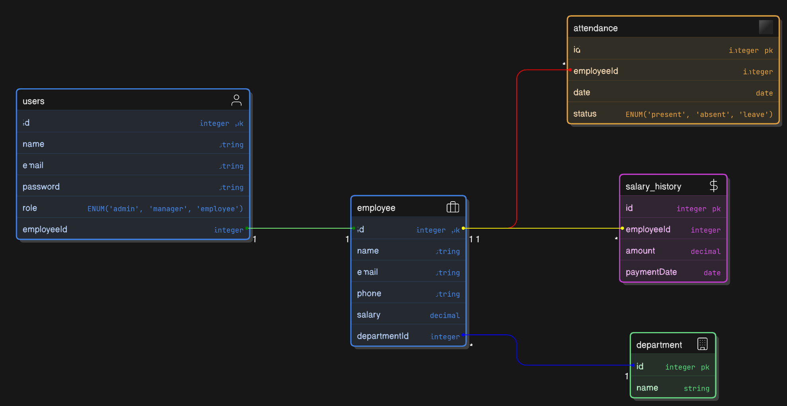

# Employee Management System

## 📌 Overview  
The Employee Management System is a **web-based application** designed to manage employees, track attendance, and maintain salary records efficiently. It supports **role-based access control (RBAC)** to ensure secure and structured access.

## 🚀 Features  
✅ **Employee Management** - Add, update, delete, and list employees.  
✅ **Department Management** - Assign employees to departments.  
✅ **Attendance Tracking** - Employees can mark and view their attendance.  
✅ **Salary Management** - Manage salary history and payments.  
✅ **Authentication & Authorization** - Secure login with JWT authentication.  
✅ **Role-based Access Control (RBAC)** - Admins and Managers have specific permissions.  
✅ **Data Validation** - Requests are validated using **AJV schemas**.  
✅ **Logging** - Winston is used for logging errors and system events.  
✅ **Database Management** - Sequelize ORM with MySQL/PostgreSQL, using **migrations and associations**.  

---

## 🏗️ Tech Stack  
- **Backend**: Node.js, Express.js  
- **Database**: Sequelize ORM (MySQL/PostgreSQL)  
- **Authentication**: JWT (JSON Web Token)  
- **Logging**: Winston  
- **Validation**: AJV  

---

## 📂 Database Schema  
  

### **Tables & Relationships**  
- **Users** → Linked to Employees (`employeeId`)  
- **Employees** → Assigned to a Department (`departmentId`)  
- **Attendance** → Tracks employee daily status (`Present, Absent, Leave`)  
- **Salary History** → Stores employee salary records (`amount, paymentDate`)  

---

## 🔑 System Flow & Role-Based Access  

### **1️⃣ Admin Adds Employee**  
- The admin creates an **employee** in the system.  
- The admin assigns an **`employeeId`** to the new employee.  

### **2️⃣ Employee Registers Using `employeeId`**  
- The employee **registers** using the provided `employeeId`.  
- The system ensures that the `employeeId` exists before allowing registration.  

### **3️⃣ Employee Logs In**  
- The employee logs in using **email & password**.  
- The system issues a **JWT token**, including the `employeeId` in the payload.  
- The employee can only perform actions permitted by their role.  

### **4️⃣ Operations Based on Role**  
| Role   | Employee Management | Attendance | Salary Management | Department Assignment |
|--------|---------------------|------------|-------------------|----------------------|
| **Admin**  | ✅ Full access (Add, Delete, Update, View) | ✅ View all attendance | ✅ Full access (Add, Update, Delete, View) | ✅ Assign employees to departments |
| **Manager** | ✅ Manage employees | ✅ View all attendance | ✅ Manage salaries | ❌ No access |
| **Employee** | ❌ No access | ✅ Mark & view **only their own** attendance | ✅ View **only their own** salary records | ❌ No access |

---

## 🔄 API Endpoints  

### 🧑‍💼 Employee Routes  
| Method | Endpoint               | Description | Role |
|--------|------------------------|-------------|------|
| GET    | `/api/employees`       | Get all employees | Admin, Manager |
| POST   | `/api/employees`       | Add a new employee | Admin, Manager |
| PATCH  | `/api/employees/:id`   | Update employee details | Admin, Manager |
| DELETE | `/api/employees/:id`   | Delete an employee | Admin, Manager |

---

### ⏳ Attendance Routes  
| Method | Endpoint                     | Description | Role |
|--------|------------------------------|-------------|------|
| POST   | `/api/attendance/mark`       | Mark attendance | Employee |
| GET    | `/api/attendance`            | Get **own** attendance | Employee |
| GET    | `/api/attendance/all`        | Get **all** attendance records | Admin, Manager |

---

### 💰 Salary History Routes  
| Method | Endpoint                 | Description | Role |
|--------|--------------------------|-------------|------|
| POST   | `/api/salary`            | Add salary record | Admin, Manager |
| GET    | `/api/salary`            | Get **only own** salary records | Employee |
| GET    | `/api/salary/all`        | Get **all** salary records | Admin, Manager |

---

### 🏢 Department Management  
| Method | Endpoint                         | Description | Role |
|--------|----------------------------------|-------------|------|
| POST   | `/api/departments`               | Create a department | Admin |
| GET    | `/api/departments`               | Get all departments | Admin, Manager |
| POST   | `/api/departments/assign`        | Assign employee to department | Admin |

---

## 🔥 Business Rules & Restrictions  
✅ **Only one admin can exist in the database.**  
✅ **Employees can view only their own salary records.**  
✅ **Employees can only mark their own attendance.**  
✅ **Admin can assign employees to departments.**  

---

## 🔧 Installation & Setup  
1️⃣ **Clone the repository**  
```sh
git clone https://github.com/your-repo.git
cd employee-management-system
npm install
DB_USERNAME=postgres
DB_PASSWORD=Acrobat@1
DB_NAME=EmployeeManagementDB
DB_HOST=127.0.0.1
DB_DIALECT=postgres

npx sequelize-cli db:migrate

npm start


